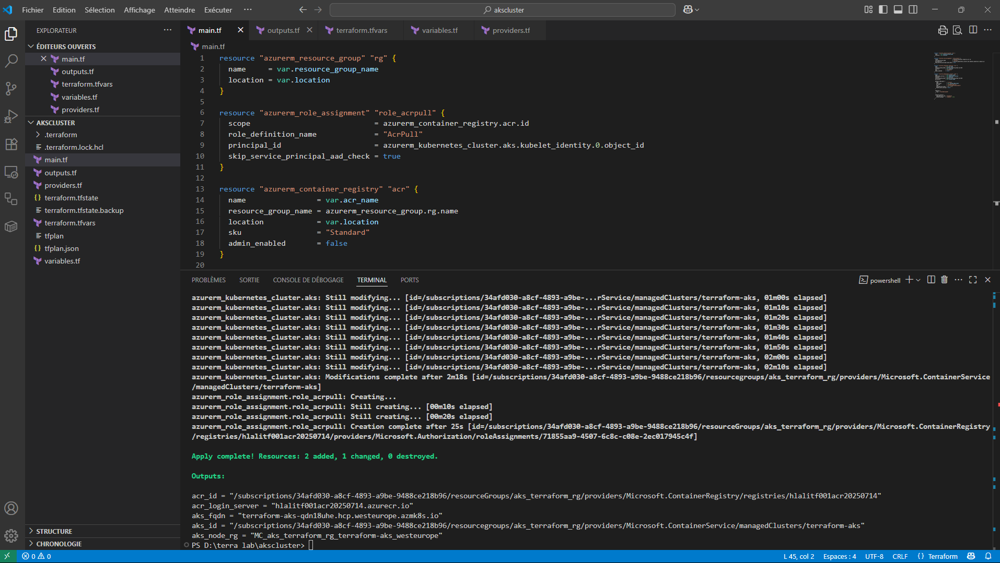

# Azure Kubernetes Cluster with ACR using Terraform ☁️🚀

This project provisions a secure, scalable **Azure Kubernetes Service (AKS)** cluster integrated with an **Azure Container Registry (ACR)** using **Terraform**.

---

## 📁 Resources Provisioned

- ✅ **Resource Group**
- 🐳 **Azure Kubernetes Service (AKS)**
- 📦 **Azure Container Registry (ACR)**
- 🔐 **Role Assignment** (`AcrPull` to allow AKS to pull images from ACR)

---

## 🔧 How to Deploy

```bash
terraform init
terraform plan -out=tfplan
terraform apply tfplan
```

> Make sure your Azure credentials are correctly configured.

<p align="center">
  
</p>


---

## 🗂️ Project Structure

```
akscluster/
├── main.tf
├── variables.tf
├── outputs.tf
├── terraform.tfvars         # (Optional: define your variables here)
├── README.md
├── diagram.png              # Architecture Diagram (see below)
└── .gitignore
```

---

## 📊 Azure Portal Diagram


---

## 🧠 Purpose of This Project

This lab demonstrates a basic real-world infrastructure setup using **Infrastructure as Code (IaC)** with **Terraform** on **Microsoft Azure**.

✅ It helps you:

- Understand AKS + ACR integration
- Use Terraform modules and outputs
- Practice role-based access control (RBAC)

---

## 📞 Contact

Project by **Hlali Mohamed Amine**  
> Connect with me on [LinkedIn](https://www.linkedin.com/in/mohamed-amine-hlali/) — Let's build modern cloud solutions together ☁️🚀

---

## 📜 License

This project is open-source and available under the [MIT License](LICENSE)